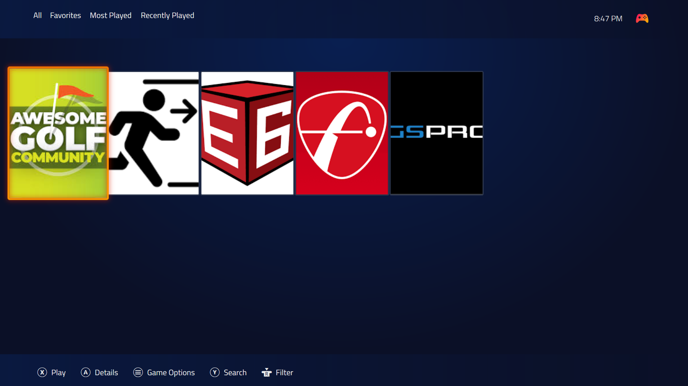

# ⛳ The Playroom Pro Shop

Welcome to the control center for **The Playroom Pro Shop** — a headless golf simulator and entertainment hub driven by an HP Z640 Workstation.

## 🛠️ The Gear

### 🟢 Hitting Station
* **Hitting Net:** [The Net Return Pro 8](https://www.thenetreturn.com/)
    * *Safety:* No Fly Zone Extension + Side Barriers
* **Turf:** Fiberbuilt Grass Series (Hourglass)
* **Launch Monitor:** FlightScope Mevo Gen 2 + Pro Package + Face Impact

### 🖥️ The Engine (HP Z640 Workstation)
* **GPU:** PNY GeForce RTX 5060 Ti Overclocked (16GB GDDR6)
    * *Power Mod:* Dual 6-pin to 8-pin Adapter.
* **Storage:** HP Z Turbo Drive (Moved to **PCI Slot 4** for Gen3 x16 speeds).
* **RAM:** 64GB DDR4
* **Displays:**
    1.  49" Ultrawide (Office Work - Primary)
    2.  27" Vertical (Code/Discord)
    3.  **Ghost Monitor:** HDMI Dummy Plug (Dedicated Simulator Feed)

### 📺 The Viewing Deck
* **Display:** 47-inch 1080P TV (Streaming Target)
* **Client:** NVIDIA Shield TV Pro running **Moonlight**.
* **Control:** Logitech K400 Plus (Wireless Keyboard/Trackpad).
* **Dashboard:** [Playnite](https://playnite.link/) (Console Interface).

---

## 🎮 The Interface
The system runs a custom **Playnite** dashboard on the Ghost Monitor. This allows for controller-friendly navigation between simulators without needing a mouse/keyboard for complex Windows tasks.

*The custom Pro Shop Dashboard running on the 4K Dummy Plug (downscaled to 1080p).*

---

## 📡 The "Headless" Architecture

To keep the office monitors free for work, the simulator runs in a "Headless" state on a virtual display.

1.  **The Ghost:** The Dummy Plug is configured to **1920x1080** to provide 1:1 pixel matching with the TV.
2.  **The Stream:** **Sunshine** (Host) captures the Ghost Monitor and streams it to **Moonlight** (Client) on the Shield TV.
3.  **The Dashboard:** We use **Playnite** running in Fullscreen Mode on the Ghost Monitor to act as a game launcher.

### 🤖 Automation Scripts ("Open Shop")
We utilize custom Batch and PowerShell scripts to manage the transition between "Office Mode" and "Sim Mode."

**Key Features:**
* **Auto-Move:** Scripts utilize `nircmd` to force game windows from the main screen to the Ghost Monitor.
* **Jumbo Mouse:** `SetCursorSize.ps1` increases cursor size to **64px** so it is visible on the TV from 10 feet away.
* **Mouse Trap:** `Dual Monitor Tools` locks the cursor to the Ghost Monitor to prevent accidental clicks on the office screens.

**Supported Software:**
* **E6 Connect** (Windowed Mode)
* **Awesome Golf**
* **FS Golf PC** (FlightScopeVideoTeachingApp.exe)
* **GSPro** (Via Launcher)

---

## 🚀 Setup & Usage

### 1. Prerequisite Software
* **NirCmd:** For window moving.
* **Dual Monitor Tools:** For mouse locking (`DMT:Cursor:LockCursor`).
* **Playnite:** Configured as a Fullscreen Launcher.

### 2. How to "Open The Shop"
1.  Turn on the NVIDIA Shield and launch **Moonlight**.
2.  You will see the **Playnite Dashboard** waiting on the TV.
3.  Use the Logitech K400 to select your game (e.g., *GSPro*).
4.  **The Script Runs:**
    * Mouse scales up (Size 64).
    * Game launches and moves to the TV.
    * Mouse locks to the TV screen.
5.  **Golf.**

### 3. How to "Close Shop"
1.  In Playnite, select the **"Close Shop"** button (The "Exit" Icon).
2.  **The Script Runs:**
    * Force closes all simulator engines.
    * Unlocks the mouse.
    * Resets cursor size to standard (32px).

---

## 📝 Configuration Notes

### Graphics Optimization (V-Sync)
To prevent interference with the main 49" Ultrawide monitor, **V-Sync is enabled Per-App** rather than globally.
* **NVIDIA Control Panel > Manage 3D Settings > Program Settings**
* **Vertical Sync:** ON (For `GSPro.exe`, `E6Connect.exe`, etc.)
* *Why:* This locks the simulator to 60Hz (matching the TV) for smooth visuals without capping the frame rate on the main office monitor.

### GPU Performance Note
* **Resolution Strategy:** By matching the Dummy Plug to the TV (1080p), the RTX 5060 Ti is not burdened with downscaling 4K content. This allows for **Ultra** graphics settings in GSPro and high frame rates for smooth ball flight.
